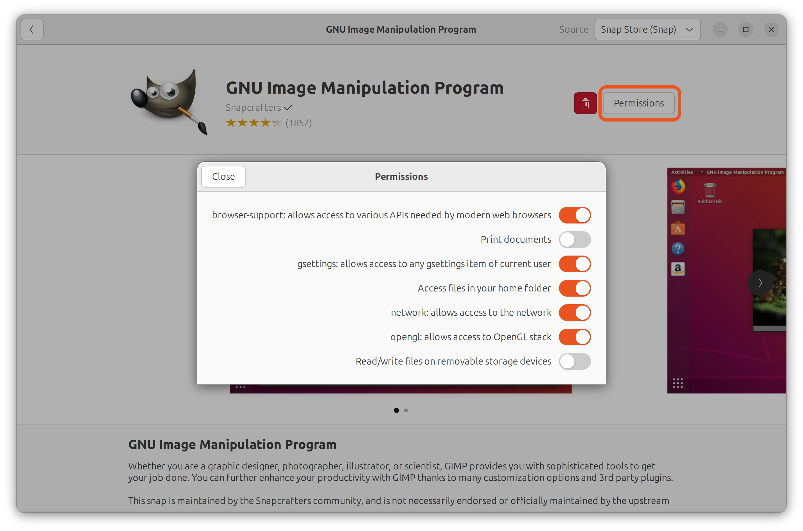

[Interfaces](/t/35928) allow (or deny) access to a resource outside of a snap's confinement.

Most users don't need to worry about interfaces. Snaps are designed for strong application isolation and safe interface connections are made automatically.

An interface is most commonly used to enable a snap to access sound playback or recording, your network, and your $HOME directory. But which interfaces a snap requires, and *provides*, is very much dependent on the type of snap and its own requirements.

See [Supported interfaces](/t/supported-interfaces/7744) for a comprehensive list of interfaces and what kind of access they permit.

## View all the snaps using an interface

Run the command:

```bash
snap interface <interface name>

```

The `interface` command shows the snaps using an interface. For example, for the audio-playback interface you'd see:

```bash
$ snap interface audio-playback
name:    audio-playback
summary: allows audio playback via supporting services
plugs:
  - chromium
  - vlc
  - zoom-client
slots:
  - snapd
```

In the previous output, you can see that Chromium, VLC and the Zoom snaps are connected to _snapd's_ audio-playback slot, which is synonymous with _Core_ and _system_.

To see all the interfaces being used by your system, run `snap interface`. To see all the interfaces available to your system, including those not currently being used, run `snap interface --all`.

## View all the interfaces used by a snap

Run the command:

```bash
snap connections <snap name>
```

The `connections` command lists the interfaces a snap uses. For example, for the VLC snap you'd see:

```bash
$ snap connections vlc
Interface         Plug                  Slot               Notes
camera            vlc:camera            -                  -
desktop           vlc:desktop           :desktop           -
desktop-legacy    vlc:desktop-legacy    :desktop-legacy    -
home              vlc:home              :home              -
mount-observe     vlc:mount-observe     -                  -
[...]
```

In the previous <!-- above, left, right, below are assuming reading direction --> example, you <!-- TODO Style guide question, as authors should we talk directly to our readers YOU instead of WE --> can see that the `vlc:camera` interface is disconnected because it has an empty *Slot* entry.

See [Interface management](/t/interface-management/6154) for further interface details, including how to disconnect interfaces and make manual connections, and [Security policy and sandboxing](https://forum.snapcraft.io/t/security-policy-and-sandboxing/554) for more information on how confinement is implemented.

To see all connected interfaces on your system, use the `snap connections` command without a snap name:

```bash
$ snap connections
Interface      Plug                    Slot                 Notes
adb-support    scrcpy:adb-support      :adb-support         -
alsa           ffmpeg:alsa             :alsa                manual
alsa           telegram-desktop:alsa   :alsa                manual
audio-playback ardour:audio-playback   :audio-playback      -
audio-playback chromium:audio-playback :audio-playback      -
(...)
```

Adding `--all` to the `snap connections` command will list all interfaces, including those without a connection:

```bash
$ snap connections --all
Interface      Plug                    Slot                 Notes
adb-support    scrcpy:adb-support      :adb-support         -
alsa           entropypianotuner:alsa  -                    -
alsa           ffmpeg:alsa             :alsa                manual
alsa           guvcview:alsa           -                    -
(...)
```

### Auto-connections

Many interfaces are automatically connected when a snap is installed, and this ability is a property of either the interface itself, or the snap.

Automatically connecting interfaces include the [network](/t/the-network-interface/7880), [audio-playback](/t/the-audio-playback-interface/13089) and [opengl](/t/the-opengl-interface/7894) interfaces. This _auto-connection_ ability is carefully reviewed for each interface, where permissiveness, security and privacy implications, and the expectations of the user, are all considered.

A snap's developer can also request that an interface is connected automatically through a [manual review process](/t/permission-requests/12822). As above, these requests are carefully considered and reviewed before being granted or denied.

Interfaces not connected automatically require the user to make a manual connection (see below), such as the [camera](/t/the-camera-interface/7776), [removable-media](/t/the-removable-media-interface/7910) and [audio-record](/t/the-audio-record-interface/13090) interfaces. Manual connections enable the user to have a complete control over what kind of access they allow.

If a snap is installed prior to an interface being granted auto-connect permission, and permission is subsequently granted and the snap updated, when the installed snap updates, the interface will be auto-connected.

For more technical details on how interface auto-connections are processed, see [The interface auto-connection mechanism](/t/the-interface-auto-connection-mechanism/20179).

> ⓘ See the _Auto-connect_ column in the [Supported interfaces](/t/supported-interfaces/7744) table for which interfaces are connected automatically.

### Manual connections

When you need to connect an interface manually, such as when you want to grant a snap access to [audio-record](/t/the-audio-record-interface/13090) for audio input, use the `snap connect` command:

```bash
snap connect <snap>:<plug interface>
```

With no further arguments, the plug will connect to the system via the snap daemon, _snapd_.

For example, to connect VLC's _audio-record_ plug to the system's _audio-record_, you'd enter the following:

```bash
sudo snap connect vlc:audio-record
```

To connect an interface to a slot provided by another snap, provide this as an additional argument:

```bash
snap connect <snap>:<plug interface> <snap>:<slot interface>
```

A slot and a plug can only be connected if they have the same interface name. 

Add the `--no-wait` option to `snap connect` or `snap disconnect` to run the process in the background and return immediately to the command prompt.

[note type="positive"]
A successful connection grants any necessary permissions that may be required by the interface to function.
[/note]

## Disconnect interfaces

To disconnect an interface, use `snap disconnect`:

```bash
snap disconnect <snap>:<plug interface>
```

Following our previous example, you would disconnect *vlc:audio-record* with the following command:

```bash
sudo snap disconnect vlc:audio-record
```

### Forget manual disconnections

When an automatic connection ([see above](#heading--auto-connections)) is manually disconnected, its disconnected state is retained after a [snap refresh](/t/managing-updates/7022). This state is even stored **after a snap has been removed**, including removal with the `--purge` option.

The `--forget` flag can be added to the disconnect command to reset this behaviour, and consequently, re-enable the automatic re-connection after a snap refresh.

## Control interfaces using a GUI

The Ubuntu Software/[Snap Store](https://snapcraft.io/snap-store) desktop application is installed by default on Ubuntu and can be used to list an application's interfaces and to connect and disconnect them.

An application first needs to be installed as a snap:


To access the interface management functions, either search for an installed snap, or select it from the _Installed_ view. To view the  interfaces for the selected application, select **Permissions**:



Each interface can now be connected or disconnected by selecting the toggle switch to the right of its description, and you may be prompted for your password.