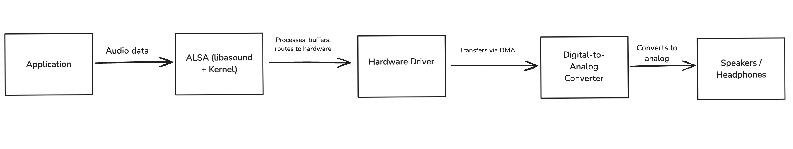

# How does Audio on Ubuntu Desktop work

This page explains how audio works on Ubuntu desktop from the hardware layer to the application layer.

## The hardware layer

When you use applications that play or record audio, they get the audio input from hardware like microphones and return audio output using speakers.

This is made possible through sound cards, which translate digital signals into the analog sound waves you hear through speakers or headphones, and vice versa for microphones. This process involves DAC (Digital-to-Analog Conversion) for output and ADC (Analog-to-Digital Conversion) for input.

Linux uses audio device drivers to interact with the sound cards. These device drivers require a kernel-level interface to transfer/receive the digital audio stream to/from applications.

Early Linux distributions (pre-2.6 kernel) used OSS (Open Sound System), the first standardized kernel-level interface that allowed applications to play and record audio. However, due to its limitations and because it was partially proprietary software, OSS was replaced by ALSA.

## Advanced Linux Sound Architecture (ALSA)

ALSA was created as a replacement for OSS to address its limitations as the default audio kernel-level interface for Linux machines. It’s an open-source driver that provides audio and MIDI (Musical Instrument Digital Interface) functionality.

ALSA interacts with audio hardware primarily through specialized device drivers provided by the Linux kernel. Its role is to abstract hardware complexity to make it easier for user-space applications to communicate with audio hardware. To achieve this, it includes specific kernel modules for different audio hardware. On booting, these modules automatically detect audio devices connected to the system, such as professional soundcards, USB audio devices, and HDMI/DisplayPort audio output.

Then, it creates special device files under `/dev/snd/` that represent audio devices. For example, `/dev/snd/pcm*` (for playback/capture), `/dev/snd/control*` (hardware mixer controls), and `/dev/snd/midi*` (MIDI interfaces).

An application playing audio involves the audio data being:

* Sent through the ALSA API (`libasound`)
* Passed through ALSA libraries and plugins
* Processed by kernel drivers
* Moved by DMA (Direct Memory Access) to the hardware
* Converted into an analog signal by the DAC (Digital to Analog Coverter)
* Played through speakers or headphones

ALSA featured efficient support for all types of audio interfaces, from consumer sound cards to professional multichannel audio interfaces, and a user-space library (`alsa-lib`) to simplify application programming — things OSS didn't have. It also supported programs that expected the older Open Sound System (OSS) API for backward compatibility.

However, ALSA had a major limitation: only one application could play audio simultaneously, without the configuration of extra software (like Dmix). Additionally, it had poor support for hotplug devices (like USB headphones), and a lack of a user-friendly GUI and per-application volume controls. To address ALSA’s limitation, sound servers were introduced to Linux machines.

## Sound servers

A sound server is an intermediary between an application (Firefox, VLC) and ALSA that manages audio streams from multiple applications, mixes them in real time, and forwards the mixed output to ALSA, which then communicates with the hardware. 

Ubuntu can run several different sound servers, including PulseAudio, JACK, and Pipewire.

### PulseAudio

From Ubuntu 8.04 to Ubuntu 21.04, PulseAudio was the default sound server. This solved most of the limitations associated with using ALSA directly, such as software mixing, per-app volume, and device hotplugging. It also introduced new features such as stream routing, which allowed you to send a stream to speakers and then move it to headphones.

However, PulseAudio was not a perfect solution. Its latency made it unsuitable for real-time tasks like music production. It also came with a complex configuration and occasional reliability issues, which sometimes made it unpredictable.

### Jack Audio Connection Kit (JACK)

JACK (Jack Audio Connection Kit) was introduced to solve problems PulseAudio couldn't solve. It was a real-time, low-latency sound server for use in music production, recording studios, and live performances.

JACK and PulseAudio didn’t work well together. Running both simultaneously required manual bridging using tools like `jack2` + `pulseaudio-module-jack`. JACK was also very difficult to set up, making it difficult to use for casual users.

### Pipewire

Pipewire, which provides a unified sound server, was introduced in 2018 and became the default sound server on Ubuntu Desktop 22.10 to solve the issues associated with using either PulseAudio or JACK. It is a drop-in replacement for PulseAudio but offers the same low latency and routing provided by JACK.

It also has built-in compatibility layers for apps expecting PulseAudio (`pipewire-pulse`) and JACK (`pipewire-jack`), ensuring they work with minimal configuration. 

With PipeWire, applications that previously needed bridges to work together can now operate seamlessly in one ecosystem.

It's still under active development. Depending on the setup, issues including Bluetooth instability or complex resampling scenarios may arise.

## Audio on applications

On Ubuntu desktop (22.10 and later), when an application plays or records audio, it interacts directly with Pipewire. If the application attemps to connect with a PulseAudio or a JACK interface, Pipewire provides an appropriate compatibility layer. Pipewire, in turn, communicates with ALSA to send or receive audio. ALSA then handles the low-level interaction with the sound card.

Some applications can also talk to ALSA directly; for example, `aplay` and `arecord` (command-line tools). Some, like Ardour and Reaper, can be configured to use ALSA or JACK directly to reduce latency. This is critical in music production, where the creator needs quick feedback as they produce and refine sounds.

## Additional Resources

- [The ALSA Project](https://www.alsa-project.org/wiki/Main_Page)
- [Pipewire](https://pipewire.org/)
- [PulseAudio](https://wiki.archlinux.org/title/PulseAudio)
- [Jack Audio Connection Kit](https://jackaudio.org/)