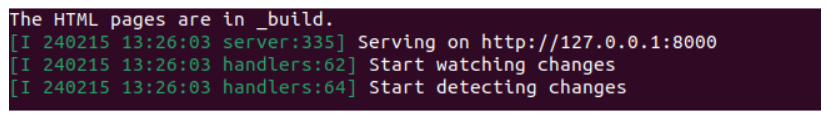

# Get started with Sphinx

If your repository uses Sphinx to create nicely rendered documentation, you will need to set up Sphinx on your machine.
This requires a small chain of steps that are needed to install other things, so you'll need to run through these steps in this order. 

## Install Python

If you recently updated your machine (with the command `sudo apt update && sudo apt upgrade`), Python3 may already be installed, but we can check that by running the following command:

```bash
python3 --version
```

If Python3 isn't there, you can run the following command to install it:

```bash
sudo apt install python3
```

## Install pip

Pip often comes installed with Python, but not always. Check if it's installed by running:

```bash
pip --version
```

If it's not installed already, run:

```bash
sudo apt install python3-pip
```

### Install Sphinx

Now you have `pip` installed, you can use it to install Sphinx (and that's the end of our chain!) with the following:

```bash
pip install sphinx
```

You will probably also need to install the Python virtual environment since it's unlikely to be installed by default. To do this, run:

```bash
sudo apt install python3.10-venv
```

This command will install all of the packages that are needed to run a virtual Python environment, but may not have come already bundled with Python3.

## Make a local build of your documentation

As you're working on your documentation, you'll want to check that your edits are having the desired effect. 

### Navigate to the open-documentation-academy folder

If you've been following along on the previous pages, you should be within a folder (possibly called `src`) that contains a sub-folder called `open-documentation-academy`. Let's check where we are first.

Type `ls` on the command line to "list show" all the files and folders you have inside your current folder. If this is a fresh Ubuntu virtual machine, you probably won't have anything yet, except for the `open-documentation-academy` folder that we created when we cloned the repository. Since we have that folder, you can do:

```bash
cd open-documentation-academy 
```

This will put you into the ODA folder that contains all of the working contents of the GitHub repository. 

If you're not sure where you are, you can run:

```bash
cd
ls
cd <directory name>
```

Running `cd` by itself will take you back to the root directory, and then you can use `ls` and `cd` to navigate to where you want to be (inside the `open-documentation-academy` folder).

If you've been following along, that will be:

```bash
cd
ls
cd src
ls
cd open-documentation-academy
```

## Build the documentation

At this point, you can build the documentation (as it currently exists) on your local machine, with:

```bash
make run
```

If `make run` doesn't work initially, then try running this sequence of commands to start with a clean build environment:

```bash
make clean
make install
make run
```

If it manages to complete the run successfully, you will see a big rush of commands and output flying past on your terminal window, and eventually, it will stop here:



This means the documentation was successfully built, and now you can view it in your web browser by right clicking on that `http://127.0.0.1@8000` link and either selecting "open link" or "copy link" (which you can then paste into your browser of choice). 

It's really convenient to have this running while you're working on your changes, because every time you save a file, it will update the build and show you a live preview of what your changes look like. 

You can close the running server at any time by pressing `Ctrl` + `C` in the window where it's running.

It's a good idea to open a second Ubuntu tab in your Terminal Window so that you can work in one tab while the documentation can be served in the other. You can do this by clicking on the down arrow next to the currently open tab, and clicking "Ubuntu" (if you're using WSL). 

