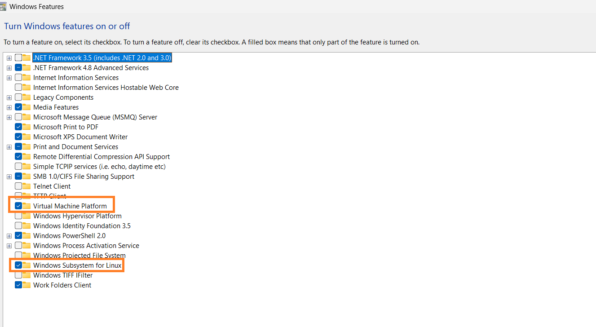

# Troubleshooting

This document aims to help you fix issues you may encounter when getting started.

## Troubleshoot a failed WSL installation

This section provides a possible way to troubleshoot a failed installation of Windows Subsystem for Linux (WSL). You can also refer to [Microsoft's official WSL documentation](https://learn.microsoft.com/en-us/windows/wsl/troubleshooting) for more information on troubleshooting WSL.

If the `wsl --install` command returns the message "This operation timed out", you can debug the issue by following these steps:

1. Using your search bar, search for "Turn Windows features on or off" and select it. It'll open a window with some options for you. In this window, you should select the following options:
    * Virtual Machine Platform
    * Windows Subsystem for Linux

    
    
2. After you select these options, open your system's task manager and navigate to the performance tab. You should look for an option that says "virtualisation" to make sure it's enabled. If it isn't enabled, follow this [Microsoft guide](https://support.microsoft.com/en-us/windows/enable-virtualization-on-windows-11-pcs-c5578302-6e43-4b4b-a449-8ced115f58e1) to enable it for your system.
    

3. Restart your machine and try the `wsl --install` command again. It should work now.

4. If you retry the command and it doesn't work as expected, you might see an error that says, "Windows Subsystem for Linux is already installed. The operation timed out".  In this case, you should update your WSL version with this command:
    ```shell
    wsl.exe --update
    ```
    Then set the default WSL version to version 2:
    ```shell
    wsl --set-default-version 2
    ```
5. Once you have completed the above steps, open your Microsoft Store and search for "Ubuntu". It's advisable to install the latest version. After the installation, you should launch the app. It'll automatically connect to your WSL and you should be able to follow the [next steps](using_wsl.md) without errors.
