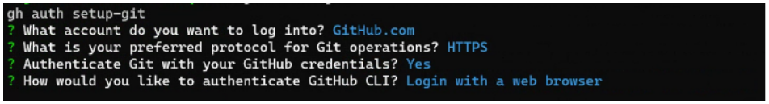
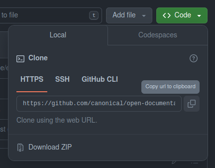
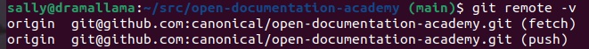
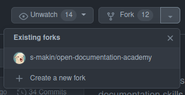
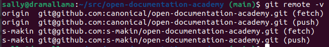
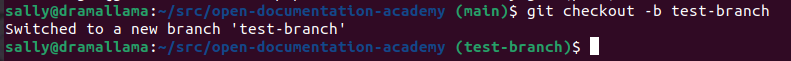
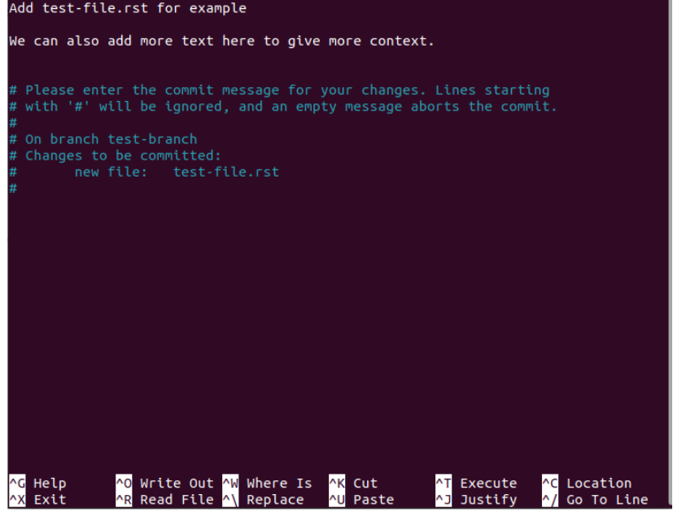

# Get started with git

To work with GitHub via the command line, we want to install `git` and set it up. Type the following command into your Ubuntu terminal window, and press enter to run it:

```bash
sudo apt install git
```

If you ever need to check what version of git you have (or if it's already installed) you can use the following command:

```bash
git --version
```

## Configure git

Now `git` is installed, we need to configure it so that GitHub can link up with your account.

Add your GitHub username (the one you use to log in to your GitHub account) by running the following command. Remember to substitute `your_username` for your actual GitHub username.

```bash
git config --global user.name your_username
```

Now let's do the same with your email (substitute for your GitHub email):

```bash
git config --global user.email your.email@canonical.com
```

This next command isn't strictly required, but is recommended to replace "master" (the default branch name) with "main" which is the more inclusive standard that many organisations are moving to. You don't need to change anything about this command, you can copy and paste it directly into your terminal window and press enter to run it:

```bash
git config --global init.defaultBranch main
```

If you want to double check the options you've configured so far, you can type:

```bash
git config --list
```

Which will show all of the configuration options that have been set.

### Install the GitHub Command Line Interface (CLI)

This will make your life much easier! On the GitHub website you'll often see commands that start with `gh`. These commands can usually be run as-is without you needing to know the corresponding sequence of `git` commands if you have the GitHub CLI. Let's install it and authorise it to access GitHub. 

To install, use the following command in your Ubuntu terminal window:

```bash
sudo apt install gh
```

### Authorise GitHub CLI to access your GitHub account

We now want to log into the authorisation helper with the following command:

```
gh auth login
gh auth setup-git
```

This will give you a series of options directly in the terminal that you can choose from, and once we go through them, it will connect your GitHub account to your Ubuntu terminal.

### Configure the GitHub CLI

You can refer to the following screenshot for help. When prompted with each of these questions, choose the option highlighted in blue. These are the simplest settings for authenticating your account. You can choose different options if you know how to set up SSH, for example, but for the easiest possible setup, these are the best options.



At the end of this step, `gh` will give you an alpha-numeric code in the format `XXXX-XXXX` directly in your terminal window. Copy this code, because you'll need it for the next step.

`gh` will then try to authenticate using your browser. It will open up a new tab or window in your internet browser and ask you to copy and paste "the code" into the spaces provided. This step will connect `gh` in your Ubuntu terminal to GitHub on the web.

### Authenticate your GitHub login

GitHub will then, in your browser, ask you to re-log in and authenticate using 2-factor authentication to confirm that it's actually you who requested the `gh` authentication above. You will usually be sent a second code (this time via your phone or other 2FA device), and it will then complete the login and connect everything up. You'll get a confirmation in your Ubuntu terminal windows and lots of green ticks everywhere if everything went to plan!

## Clone the repository onto your machine

Now we can clone repositories directly to your machine using the HTTPS option. If you intend to do work on multiple repositories, it's a good idea to first make a folder to put them all in. I have called my folder `src` - you can call it something else if you'd like, or if you're happy with `src` you can copy and paste this command directly into your terminal:

```bash
mkdir src
cd src
```

After making the folder (with `mkdir`), we have then navigated to it using `cd` (change directory).

Now that we are inside the new folder, we need to find the "address" for the repository we want to clone. In our browser window, let's go to the GitHub website and navigate to the repository we're interested in cloning. In this case, I'm using the [Open Documentation Academy](https://github.com/canonical/open-documentation-academy) repository, but you can use another repository if you like.

Now, we can click on the green button that says `< > Code`, click on the "Local" tab, and then on the HTTPS sub-tab. Copy the URL that's shown in the box below that. 



We can then return to our terminal window and clone the repository - the command always looks something like this:

```bash
git clone <repository URL or SSH address>
```

In this case, we want to use the HTTPS link, so run this command to clone the Open Documentation Academy repository:

```bash
git clone https://github.com/canonical/open-documentation-academy.git
```

This will download everything into a new folder *inside your `src` folder*, called "open-documentation-academy". This will be important later!


## The main branch

So far, we've downloaded the main repository onto our machine. The "address" of this repository is usually `origin/main`. We can see this if we type the following command:

```bash
git remote -v 
```



The repository is called "origin" by default (on the left) and the address on GitHub is on the right. By default, we are working on the "main" branch, and when we want to push or pull content, or to submit pull requests, we specify the **address** for where to push/pull from in the format:

```bash
git push origin main
```

This means we want to push to the **origin** repository, and the **main branch** of that repository.

## Setting up your own fork and main branch

It's normal to make a copy of the repository for yourself to work on. We call this a **fork**.

You can make a fork on the GitHub website by navigating to the repository you want to fork, and clicking on the "fork" button.



If you have already made a fork, you'll see it if you click on the little drop-down arrow beside the fork button. You can click on your existing fork to navigate to it. You're now on the main branch of your own fork, instead of the main branch of the origin repository.


As you can see with the example of my fork, in the top left you will be shown which repository your fork comes from. If your fork is out of date with the main repository you'll see a warning that the branch is some number of commits behind the original repository. You can click on the "sync fork" button to fetch those changes and apply them to your own fork. This will bring it up to date.

### Add your fork as a remote

One thing we definitely want to do is to add our own fork as a "remote" repository on the command line. This will allow us to push the changes we want to make from our machine back to the origin repository.

While you're on your fork, click on the green code button, and select the "HTTPS" tab. Copy the URL that's shown there, as in the screenshot below. 


Now return to your Ubuntu terminal and type the following:

```bash
git remote add <your_username> <URL>
```

Make sure you change `<your_username>` to match your GitHub username, and then paste the URL we just copied, before you run the command. 

So as an example, for me to add my own fork as a remote repository on my local machine, I would type:

```
git remote add s-makin https://github.com/s-makin/ubuntu-pro-docs.git
```

And then if I retype the `git remote -v` command, I will see the following output:



If I then wanted to push some changes I made on my local machine to my own fork, I'd use the command `git push s-makin main`.

## How branches work

At this point, I've mentioned branches quite a bit, but let's delve a bit into what they are and why we use them.

Although we can just use our fork to push our changes to, sometimes we might be working on more than one set of changes at a time -- it can get very messy if we try to make different sets of changes in one pull request.

For reviewers especially, it can be very confusing if we just keep piling all our changes onto the main branch. So, we create additional branches to keep all our changes self-contained and tidy.


Let's say we start off with the original repository (which we know has the address `origin/main`). We make a direct copy of it (our fork, which is called `your fork/main`).

At this point, we have some changes we want to work on, so we make a copy of the `your fork/main` branch, which we can call `branch #1`. The "address" of that branch will be `your fork/branch #1`. We can make a bunch of changes to that branch without affecting the contents of the main branch, or the original repository.

Then, let's say we want to start working on some different changes, that are completely unrelated to our work on `branch #1`.

We then go back to `your fork/main` and make another, separate copy of it. This we'll call `branch #2`, which has the address `your fork/branch #2`. Both `branch #1` and `branch #2` started off as copies of the `your fork/main` branch, but as you work on them separate, will come to contain completely different sets of changes.
 
### Working with branches

Branches can be a bit confusing at first, but after you start working with them, they soon make sense!

So, now that you have set up your fork, you've added your remote address locally, and you're on the `main` branch of your fork. Now, we can create a new branch.

```bash
git checkout -b test-branch
```

`checkout` is the command we use to switch between branches, but when we include the `-b` option, we are telling git to also create the `test-branch` branch at the same time. Usually, we will use separate branches for every pull request we intend to submit, so we can keep things tidy and can work on multiple things at once.



At any time we can check which branch we are working on using:

```bash
git branch
```

This will show us a list of all our active branches, including the one we're on. If we ever want to delete a branch (which we usually do after the associated pull request has been merged), we can do:

```bash
git branch -d name-of-the-branch
```

### Committing changes

Once you're happy with the changes you've made, you can use:

```bash
git status
```

Which will give you a summary of all the files that have been changed. It's a good idea to use this command as a double-check every time you do any actions around committing, to be sure that everything is going as you expect! Any files that show in green are on the list of changes to be committed, while files in red are not yet, and must be added.


First we need to add the changes we want by adding them to the list of **staged** files:

```bash
git add filename1.rst filename2.rst
```


Then we commit the files that have been staged (the ones that show up in green):

```bash
git commit
```

This will bring up a new screen where you can write your commit message.



We try to be as descriptive but as concise as possible in the first line, so that anyone else who looks at the commit history can understand what changes you've made, and we can use the lines after that to explain the context if necessary. 

When you're happy with the commit message, press "Ctrl + S" together to save the message, and then "Ctrl + X" together to exit the message window.

### Push your changes

Once all your changes have been committed, you can push them to your remote fork by doing the following command:

```bash
git push <your-remote-name> <your-branch>
```

So in this example, I would push to:

```bash
git push s-makin test-branch
```

The next time I go to the main repository on the website, I should have a yellow banner at the top of the page informing me that there are changes, and inviting me to create a pull request. 

## Create a pull request

Now you have pushed your changes to your remote fork, you can go back to the GitHub website. Navigate to the Open Documentation Academy repository page, and you should see a banner like this:


You can click on the "Compare and pull request" button to review what you've submitted, and to create a pull request. The pull request is used to **pull** the changes from your remote fork into the original repository.


In the line at the top, we can see that we are proposing to bring changes from my test branch, on my fork into the origin repository's main branch. 

When we open a pull request, we usually include a description as well, to say what changes we've made (and why), and sometimes a repository will have other information they want you to include with your pull request. In those cases, they might have a template that you should fill out. Not following the template (if one is provided) can slow down the process of getting your PR approved and merged. 

When you're happy with your message, click the "Create pull request" button. At this point, the maintainers of the repository will be notified of your new pull request, and it will undergo a review process. As part of that process you might be asked to...

## Edit a pull request

As long as you pay attention to the branch you're working on, editing PRs is straightforward even if you have multiple branches active (e.g. if you're working on multiple pull requests at once). 

Let's say you have two branches, `branch-1` and `branch-2`, each of which has a single pull request against it (`PR-1` and `PR-2` respectively). If we're currently working on `branch-1` and we want to make some edits to `PR-2`, we'll first need to switch to `branch-2`. 

```bash
git checkout branch-2
```

It's always a good idea to double check what your active branch is using `git branch` before you make any changes to your branch. You can then make your changes, add and commit them as you have done before, and then all you have to do is push them to the same branch:

```bash
git push <your-remote-name> <your-branch>
```

This will take the changes you have made, and update your pull request automatically!

You can make as many changes as you like using this method, until the pull request is ready to be accepted and merged.
 
## Updating, rebasing and merge conflicts

Sometimes you'll have a pull request "in flight" (not yet merged), and someone will make some changes to the repository that you need to incorporate into your branch. This can often lead to "merge conflicts", where you'll need to resolve the conflict before you can proceed.

```bash
git fetch origin main

git rebase -i origin/main
```

We need to install a tool (`meld`) that will help us to resolve merge conflicts. You should be able to copy/paste all of this into your Ubuntu terminal in one block. This will install Meld and configure it to automatically open up any conflicting files (with both versions) so you can manually review and accept the correct versions of each change. 

```bash
sudo apt install meld
git config merge.tool
git config --global merge.tool meld
git config --list  #should see merge.tool=meld in the list
git config --global mergetool.meld.cmd 'meld $LOCAL $MERGED $REMOTE --output $MERGED'
git config --list  #should see mergetool.meld.cmd=meld $LOCAL $MERGED $REMOTE --output $MERGED
```

Now when you do a rebase, if there is a conflict, you can resolve it, and then type:

```bash
git rebase –continue 
```

Then you should be able to push your changes to your own PR without any further issues.

## After your PR is merged

Once you have finished making your changes, and the PR has been accepted and merged, you will not need the branch anymore.

At this point, you can use the command:

```bash
git pull
```

To make sure your branch is up to date with the remote branch, then switch to the main branch on your fork with:

```bash
git checkout main
```

Then, you can use `git branch` to double check the name of the branch (and to confirm that you're on the main branch!), then delete the branch for your PR with:

```bash
git branch -d <your branch name>
```

So using my previous branch `test-branch` as our example, the command I would use is:

```bash
git branch -d test-branch
```
