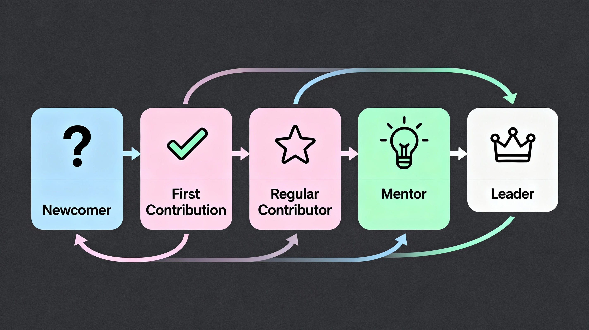

# Our ambition for the Open Documentation Academy

We create opportunities for people who are new to open source by connecting them with documentation tasks on established projects. We provide assistance and mentoring on these tasks, so that members develop skills in a safe and supportive environment.

With our help, your open source journey can be a valuable experience that you can be proud of and receive tangible recognition for.

---

## Our vision

__Documentation accessible to all. Contribution possible for everyone. Leadership within reach.__

At CODA—the Canonical Open Documentation Academy—we envision a future where *quality documentation forms the foundation and lifeblood of open-source ecosystems*. We see a world where *clear, accessible, and thoughtful content demystifies technology*. This environment welcomes both newcomers and experienced contributors from every corner of the globe. Together, we commit to build a collaborative and innovative community where open source thrives for generations to come.

---

## Our mission

To build the premier global community advancing open-source documentation excellence through mentorship and collaboration.

As a pioneering program focused on the craft of documentation, the Open Documentation Academy:

- **Enables** members to build skills in a welcoming and nuturing environment  
- **Cultivates** a thriving worldwide community through workshops, regular sessions, and personalised guidance  
- **Delivers** clear learning paths, systematic support, and visible recognition to help participants become proficient documentation creators  
- **Removes obstacles** to open-source engagement by establishing documentation as the primary entry pathway

---

## Our vision for your journey at CODA

Every CODA member follows their own path, but most journeys include these milestones:

- **Newcomer**: Join our forum, introduce yourself, and connect with a personal coach  
- **First Contribution**: Select a curated task and submit your initial documentation work  
- **Regular Contributor**: Build your portfolio, develop consistent skills, and earn official certification
- **Mentor**: Guide new members, share your expertise, and strengthen the community  
- **Leader**: Spearhead documentation initiatives and shape the future of projects
