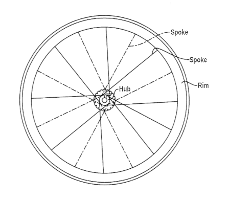

# Our vision

_Discover open source through documentation._

## Mission

Canonical's Open Documentation Academy, or CODA, aspires to be the centre of open source collaboration through documentation.

We create opportunities for people who are new to open source by connecting them with documentation tasks on projects of distinction. We provide assistance and mentoring on these tasks, so that members develop skills in a safe and supportive environment. With our help, your open source journey can be a valuable experience that you can be proud of and receive tangible recognition for.

## What drives us

The world of open source collaboration is diverse. There's no singular vision or definition of the idea, meaning that different people and projects hold different values and practice it differently. A person's introduction to it might not always be compassionate or helpful, and many people have rocky starts. There are a few different explanations for this.

The majority of open source projects out in the world were created by happenstance on collaboration platforms like GitHub and GitLab, with no serious vision for contribution. These projects are often abandoned, so you can't always get meaningfully involved.

Some projects proclaim their open sourcing enthusiastically, but their passion gets the better of their experience. They lack a robust, practical collaboration model. It's often difficult to contribute to these projects because they practice it impulsively or without care.

Some projects misuse the good will of open source. They might have badly-behaving members who make their community noxious. Or, they might use contribution to exploit the work of well-meaning individuals. The experience of contributing to them can be dehumanising and hurtful.

Your experience with open source should be joyful, exciting, and human. That's what CODA is about.

We think open source can be done better. The most important concern of an open source project should be its people and how they collaborate, not its technical development. The very nature of any project is to be a social enterprise, in other words to be about the work between people. Successful and healthy projects operate with this understanding, and we want to connect people with them.

## Organisation

CODA is arranged as a meta-project for other open source projects. We collaborate with any project that shares our values to coordinate opportunities for open source enthusiasts to participate with them.

It's like the hub and spokes on a bicycle wheel. CODA, the hub, is at the centre, and the connections to our affiliates are like spokes. Our members' work happens on those projects, on the rim, revolving around the coordination we provide.

CODA was founded by Graham Morrison, and is moderated by the documentation team at Canonical. Graham and his team members set standards for good behaviour and hold themselves accountable for the long-term health and growth of the Academy.
Anybody who participates in a CODA space or works on a CODA task is a CODA member. By participating, they agree to uphold the values of CODA by setting the standard for open source collaboration and to abide by our [code of conduct](https://ubuntu.com/community/docs/ethos/code-of-conduct).

## Culture and values

Most open source projects trace their lineage to the hacker culture of the 1980s and 1990s. In those days, it was unthinkable that one day organisations as important as banks would be running Linux software. But time has passed, Linux is ubiquitous, and there are more developers and projects in the public than ever.

As open source culture has become widespread and global, its champions must think about collaboration in cosmopolitan terms. CODA was therefore founded on six values.

**Humanity**. We must recognise and cherish the humanity in each other, and never value our work above it. We operate with compassion, and we don't forget the person behind the keyboard.

**Openness**. Open means open for all to see, and open for all to give. Anybody can get involved in CODA. All major decisions and discussions are made in public and open spaces.

**Equity**. We embrace all identities – race, nationality, ethnicity, religion, age, sex, sexual orientation, gender identity or expression, and ability. We acknowledge the inequalities of opportunity that many undergo, and make efforts to offset those differences in our programs. We provide opportunities for different kinds of knowledge, abilities, and experience. We respect everyone's uniquenesses and quirks.

**Generosity**. The spirit and joy of open source is giving and sharing. We must give freely, altruistically, and without expectation of reward.

**Humbleness**. The complement of giving is receiving. We receive with grace, and are thankful when we receive the generosity of others. We thank them for the act, not its contents.

**Excellence**. We hold ourselves to the highest standard of conduct. We are global ambassadors of open source, and so behave with utmost professionalism, decorum, and good will.

## Programs

The primary operational goal of CODA is to make open source approachable. Our objective is to provide a model and a space for open source and documentation.

We focus on documentation contributions because they present an opportunity for the public to share their direct experience with software to its maintainers, it has the lowest barrier to entry, it is low risk, and because documentation is always evolving and growing in projects. By contributing to documentation, members get closer to the software itself, which is good preparation if they want to engage as developers, too.
CODA delivers two programs to fulfil the main objective.

### Community hour

The [community hour](https://discourse.ubuntu.com/t/community-hour/42771) is a weekly public event where people from around the world gather to present about and discuss documentation and the open source community. Discussions revolve around documentation theory and practice, career advice, computing technology, and open source projects.

Members benefit from this program by developing skills, receiving help with their career development, accessing world-class and highly-experienced experts, and connecting with like-minded people.

### Community tasks

The [community tasks](https://github.com/canonical/open-documentation-academy/issues) program promotes work in affiliate projects to CODA members. Affiliated open source projects can apply the CODA tag to their open issues and tasks. When tagged, the task becomes visible to members through an aggregator.

A member or squad of members can then volunteer for that task. When needed, they can use the expertise of other members to connect with the affiliate project's maintainers to refine the task scope and requirements, and for mentorship and help.

Members can also explore a project's documentation and the software itself, looking for gaps and pain points, and create tasks for improving it.

Members benefit from this program by being provided with a safe environment to explore and work in, receiving direct assistance with their open source contributions, being provided with tasks and opportunities that match their skills, and public recognition for their work. All successful contributions from members are recognised.
