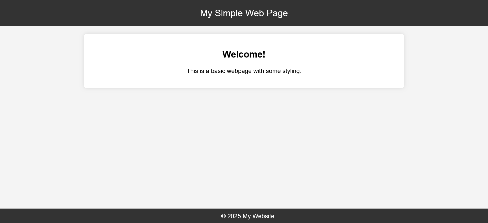

# Develop with Ubuntu on WSL

The built-in tooling and Windows interoperability provided by Ubuntu on WSL
make it a powerful development environment.

In this tutorial, we guide you through a tiny web project to show what is
possible with Ubuntu on WSL.

## What you will learn

- Setting up Ubuntu on WSL on Windows
- Using Ubuntu's built-in tools to create and edit files
- Serving a simple web project from Ubuntu to a Windows browser
- Using Visual Studio Code to develop with Ubuntu on WSL
- Creating a service on Ubuntu to automatically serve a web page
- Sharing files between Windows and Ubuntu

```{note}
This tutorial assumes limited knowledge of web dev and Linux.
```

## What you will need

- A PC with Windows 10 or 11

## Install Ubuntu on WSL2

Windows Subsystem for Linux (WSL) must first be installed on your machine before you can use Ubuntu on WSL.

### Install WSL

Open PowerShell as an Administrator and run:

```{code-block} text
> wsl --install
```

This command will enable the features necessary to run WSL and also install the latest Ubuntu distribution available for WSL. It is recommended to reboot your machine after this initial installation to complete the setup.

### Install Ubuntu on WSL

WSL supports multiple Ubuntu releases, and you can install several Ubuntu
instances on your machine at the same time. For more information about
available distributions, see our [reference
guide](https://documentation.ubuntu.com/wsl/en/latest/reference/distributions/).

At any one time, multiple instances of Ubuntu on WSL can be installed on the same machine.

There are multiple ways of installing Ubuntu on WSL, here we focus on using the terminal.
For other installation methods, refer to our dedicated guide:

- [Install Ubuntu on WSL2](https://documentation.ubuntu.com/wsl/en/latest/guides/install-ubuntu-wsl2/)

In a PowerShell terminal, run `wsl --list --online` to see all available distros and versions:

```{code-block} text
The following is a list of valid distributions that can be installed.
The default distribution is denoted by '*'.
Install using 'wsl --install -d <Distro>'.

  NAME                                   FRIENDLY NAME
* Ubuntu                                 Ubuntu
  Debian                                 Debian GNU/Linux
  kali-linux                             Kali Linux Rolling
  Ubuntu-18.04                           Ubuntu 18.04 LTS
  Ubuntu-20.04                           Ubuntu 20.04 LTS
  Ubuntu-22.04                           Ubuntu 22.04 LTS
  Ubuntu-24.04                           Ubuntu 24.04 LTS
...

```

This shows that the default Ubuntu release is already installed.
It also shows other supported Ubuntu releases, in addition to other
distributions like Debian, from which Ubuntu is derived.

You can install a version using a NAME from the output, for example:

```{code-block} text
> wsl --install Ubuntu-24.04
```

You will then see an indicator of the installation progress in the terminal:

```{code-block} text
Installing: Ubuntu 24.04 LTS
[==========================72.0%==========                 ]
```

After installation, your new Ubuntu instance will open.

### Log in to Ubuntu and run commands

Enter a username and password for the instance and
you will be greeted with a welcome message:

```{code-block} text
Welcome to Ubuntu...
...
...
```

You can now confirm that you're in a Linux environment by running:

```{code-block} text
$ uname -o
```

This should output:

```{code-block} text
GNU/Linux
```

You can also get information about the specific Ubuntu distro that you are using:

```{code-block} text
lsb_release -a
```

This will output the following for the Noble release.

```{code-block} text
Distributor ID: Ubuntu
Description:    Ubuntu 24.04.2 LTS
Release:        24.04
Codename:       noble
```

## Creating and viewing files in Ubuntu

Let's see how to work with files using Linux tools and Windows Explorer.

### Edit files and directories in the Ubuntu terminal

First, make a new directory called **webTest** using the `mkdir` command:

```{code-block} text
$ mkdir webTest
```

Next, change into that directory using `cd`:

```{code-block} text
$ cd webTest
```

Ubuntu on WSL comes pre-installed with several terminal-based tools for editing text, including Vim and Nano.

Inside the `webTest` directory, type the following command to open a new `index.html` file in the Nano editor:

```{code-block} text
$ nano index.html
```

Paste this short snippet into the editor:

```html
<h1>Hello world!</h1>
```

Type `ctrl + s` to save your file and then `ctrl + x` to exit the edtior.

### Browse your Ubuntu files graphically in Windows Explorer

You can open files in Windows Explorer from Ubuntu by typing the command below:

```{code-block} text
$ explorer.exe .
```

The command will open the current folder (indicated by `.`) by calling the Windows Explorer executable.

If you opened `webTest`, you should see the `index.html` file that you created.

```{note}
At any point, you can also find Ubuntu file systems under Linux in Windows Explorer; for example,
the `webTest` folder can be found at `Linux > Ubuntu > home > yourusername > webTest`.
```

Many Windows executables can be called from Ubuntu in this way.
If you prefer to use Notepad for basic text editing in Ubuntu, you can use it too:

```{code-block} text
notepad.exe index.html
```

### Serve static HTML in WSL with Python

Python comes pre-installed with Ubuntu on WSL.
We can immediately take advantage of this by using it to serve our HTML in a single command.

Make sure that you are in the `webTest` directory before running the following command to start a server:

```{code-block} python
$ python3 -m http.server
```

Now click [http://localhost:8000/](http://localhost:8000/) and "Hello world" should appear in your default Windows browser.


You can edit the HTML file to see the changes in real-time. With the server
still running, open a second instance of the same Ubuntu distro.

In that second instance, open the file for editing with `nano index.html` and
make a small change. Save the file and refresh the browser to confirm the
change.

You can stop the server by pressing `ctrl + c` from within the terminal where it is running.

## Develop in Ubuntu with Visual Studio Code

Visual Studio Code can be used to develop with Ubuntu on WSL using its powerful remote development extension.

### Installation and configuration

To install Visual Studio Code, visit the Microsoft Store and search for "Visual Studio Code".


During installation, under the 'Additional Tasks' step, ensure you check the `Add to PATH` option.


Open VSCode, navigate to the `Extensions` menu in the sidebar and find the `Remote Development` extension from Microsoft.


### Develop in Ubuntu with Visual Studio Code

In Ubuntu, make sure you are in `webTest` by printing the working directory:

```text
$ pwd
```

Once inside `webTest`, open the project in VSCode:

```text
$ code .
```

The first time you do this, it will download a VSCode server that can communicate with the VSCode application.


Once complete, your project will open in Visual Studio Code.

Visual Studio Code comes with many powerful development features and
a large range of extensions.

If you want to learn one way that it can help speed up development, you can try
its built-in HTML snippets.

First, delete everything in `index.html`. Now start typing `HTML` and when the
popup appears choose `HTML:5`. This will generate HTML5 boilerplate, which
improves the rendering, discoverability and responsiveness of web pages:

```html
<!DOCTYPE html>
<html lang="en">
<head>
    <meta charset="UTF-8">
    <meta name="viewport" content="width=device-width, initial-scale=1.0">
    <title>Document</title>
</head>
<body>
    
</body>
</html>
```

You can then tab through placeholder text. Tab twice to get to "Document" and change it to "To-do app".
Now place your cursor within the body tags, type `h1+ul>li*3` and hit **enter** to generate:

```html
...
<body>
    <h1></h1>
    <ul>
      <li></li>
      <li></li>
      <li></li>
    </ul>
</body>
...
```

```(tip)
The snippet `h1+ul>li*3` means:

  Create a **h**eader tag **AND** an **u**nordered list,
  and inside that list create three **li**st items
```

An example of the completed HTML:

```html
<!DOCTYPE html>
<html lang="en">
<head>
    <meta charset="UTF-8">
    <meta name="viewport" content="width=device-width, initial-scale=1.0">
    <title>To-do</title>
</head>
<body>
    <h1>To-do list</h1>
    <ul>
      <l1>Learn Ubuntu</l1>
      <l1>Use VSCode with Ubuntu</l1>
      <l1>Make an app</l1>
    </ul>
</body>
</html>
```

Now type `ctrl + j` to open up a terminal inside VSCode.
Notice that this opens the project directory in an Ubuntu terminal.
A server can be started just like before:

```text
$ python3 -m http.server
```

Visit [http://127.0.0.1:8000/](http://127.0.0.1:8000/) to view the web page in your browser.



Press `ctrl + c` in the terminal to stop the server.

## Automatically serve a web page when Ubuntu starts

We have been manually starting our server each time. What if we want the server
to always run when we open the Ubuntu instance with our web project?

A tool called `systemd` in Ubuntu manages background processes on boot.
This enables the [snap daemon (snapd)](https://snapcraft.io/docs) -- for example -- to run in the background in Ubuntu on WSL,
so that software can be installed as snaps.

Systemd is enabled by default on all supported versions of Ubuntu on WSL.
To check run the following within Ubuntu:

```text
$ cat /etc/wsl.conf
```

The following indicates that systemd is enabled on boot:

```text
[boot]
systemd=true
```

### Create a systemd service to automatically serve your web page

First, you need to create a service for `systemd` to run.

1.  Create a new `systemd` service file called `py-server`:

    ```text
    $ sudo nano /etc/systemd/system/py-server.service
    ```

    The `sudo` is necessary to give you elevated priviliges and
    you will need to type in your password before the file opens.

2.  Paste the following into the editor, taking care to modify `User` and `WorkingDirectory` as appropriate:

    ```text
    [Unit]
    Description=Python HTTP Server to run a web page
    After=network.target

    [Service]
    Type=simple
    User=<replacewithyourusername>
    WorkingDirectory=/home/<replacewithyourusername>/webTest
    ExecStart=/usr/bin/python3 -m http.server 3000
    Restart=on-failure

    [Install]

    WantedBy=multi-user.target
    ```

    Port 3000 is specified here so as not to block the default 8000 port.
    Type `ctrl + s` to save and `ctrl + x` to exit the editor.

3.  Reload `systemd` so it can recognize this new service:

    ```text
    $ sudo systemctl daemon-reload
    ```

4.  Enable the service to start at boot:

    ```
    $ sudo systemctl enable py-server.service
    ```

    You should see the following result:

    ```text
    Created symlink /etc/systemd/system/multi-user.target.wants/py-server.service → /etc/systemd/system/
    py-server.service.
    ```

5.  Start the service with this command:

    ```text
    $ sudo systemctl start py-server.service
    ```

6.  Check that the service is running:

    ```text
    $ sudo systemctl status py-server.service
    ```

Now restart your Ubuntu on WSL instance. Once you reopen the terminal, your web
page should already be running when you visit
[http://localhost:3000/](http://localhost:3000/).

If you want to stop serving the web page, close Ubuntu or stop the service in the Ubuntu terminal:

```text
$ sudo systemctl stop py-server.service
```

## Move files between Windows and Ubuntu

Windows interoperability is a core feature of Ubuntu on WSL.
This makes it easy to work across the two file systems.

### Copy a file from Windows in the Ubuntu terminal

WSL automatically mounts Windows drives under `/mnt/`.

Download any image file you can find. Let's assume it's called `image.png`.

By default, this will be downloaded to the `Downloads` folder in your C drive on Windows.

In Ubuntu on WSL, you can list those files with:

```{code-block} text
ls /mnt/c/Users/<yourusername>/Downloads/
```

To copy the image to your project directory:


```{code-block} text
cp /mnt/c/Users/<windowsuser>/Downloads/image.png /home/<ubuntuuser>/webTest/
```

The image can then be used in your HTML:

```html

```

## Removing your instance

You can check what instances you have installed currently with:

```{code-block} text
> wsl -l -v
```

This outputs the installed WSL distros, whether they are running, and the
version of WSL that they are using:

```{code-block} text
  NAME            STATE           VERSION
  Ubuntu-20.04    Stopped         2
* Ubuntu-24.04    Stopped         2
```

Confirm that the instance you want to remove is `Stopped`.

Then remove it with the following command:

```{code-block} text
> wsl --unregister Ubuntu-24.04
```

## Enjoy Ubuntu on WSL!

In this tutorial, we set up Ubuntu on WSL as a Linux development environment on Windows.
We connected Visual Studio Code to Ubuntu on WSL and used it to make a HTML web page that could be served with Python.
With the systemd tool in Ubuntu, we automated the process of serving the web page each time the Ubuntu instance starts.
Lastly, we used standard Linux commands to move files between Windows and Ubuntu.


We hope you enjoy using Ubuntu inside WSL. Don’t forget to check out our other tutorials for more tips on how to use WSL.

### Further Reading

- [Install Ubuntu on WSL2](../howto/install-ubuntu-wsl2.md)
- [Microsoft WSL Documentation](https://learn.microsoft.com/en-us/windows/wsl/)
- [Setting up WSL for Data Science](https://ubuntu.com/blog/wsl-for-data-scientist)
- [Windows and Ubuntu interoperability](https://github.com/ubuntu/WSL/blob/main/docs/tutorials/interop.md)
- [Run a .NET Echo Bot as a systemd service on Ubuntu WSL](https://github.com/ubuntu/WSL/blob/main/docs/tutorials/dotnet-systemd.md)
- [Ask Ubuntu](https://askubuntu.com/)
