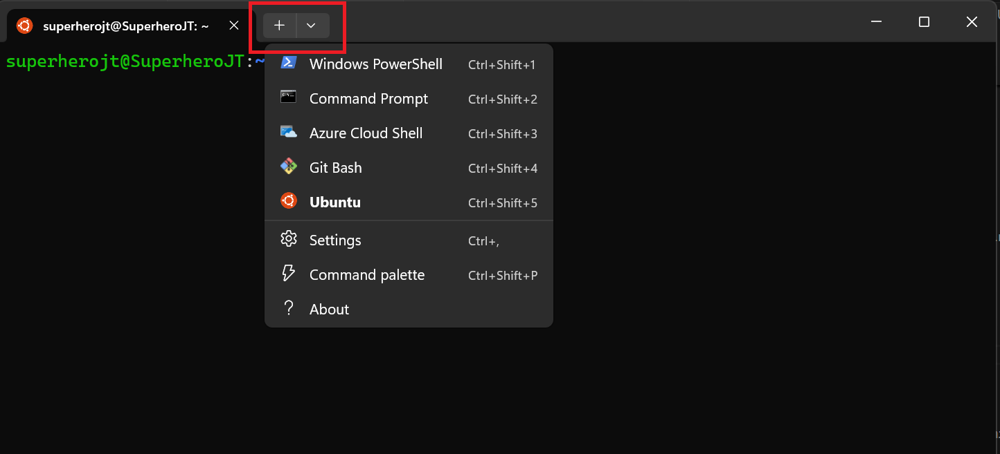

# Develop with Ubuntu on WSL

The easiest way to access your Ubuntu development environment in WSL is by using Visual Studio Code via the built-in `Remote` extension.

## What you will learn

- How to install WSL and Ubuntu on WSL from the terminal
- How to set up Visual Studio Code for remote development with Ubuntu on WSL
- How to preview HTML served from an Ubuntu WSL instance in a native browser on Windows
- How to share files between Windoes and Ubuntu WSL
- How to run a service when a new Ubuntu WSL instance is created

## What you will need

- A PC with Windows 10 or 11

## Install Ubuntu on WSL2

The Windows Subsystem for Linux (WSL) must first be installed on your machine before you can use Ubuntu on WSL.

### Install WSL

Open a PowerShell prompt as an Administrator and run:

```{code-block} text
> wsl --install
```

This command will enable the features necessary to run WSL and also install the latest Ubuntu distribution available for WSL. It is recommended to reboot your machine after this initial installation to complete the setup.

### Install Ubuntu on WSL

WSL supports a variety of Ubuntu releases. Check our [reference on the distributions](https://documentation.ubuntu.com/wsl/en/latest/reference/distributions/) for more information.

There are multiple ways of installing Ubuntu on WSL, here we focus on using the terminal.
For other installation methods, refer to our dedicated guide:

- [Install Ubuntu on WSL2](https://documentation.ubuntu.com/wsl/en/latest/guides/install-ubuntu-wsl2/)

In a PowerShell terminal, run `wsl --list --online` to see all available distros and versions:

```{code-block} text
The following is a list of valid distributions that can be installed.
The default distribution is denoted by '*'.
Install using 'wsl --install -d <Distro>'.

  NAME                                   FRIENDLY NAME
* Ubuntu                                 Ubuntu
  Debian                                 Debian GNU/Linux
  kali-linux                             Kali Linux Rolling
  Ubuntu-18.04                           Ubuntu 18.04 LTS
  Ubuntu-20.04                           Ubuntu 20.04 LTS
  Ubuntu-22.04                           Ubuntu 22.04 LTS
  Ubuntu-24.04                           Ubuntu 24.04 LTS
...

```

Your list may be different once new distributions become available.

You can install a version using a NAME from the output, for example:

```{code-block} text
> wsl --install -d Ubuntu-24.04
```

You'll see an indicator of the installation progress in the terminal:

```{code-block} text
Installing: Ubuntu 24.04 LTS
[==========================72.0%==========                 ]
```

Use `wsl -l -v` to see all your currently installed distros and the version of WSL they are using:

```{code-block} text
  NAME            STATE           VERSION
  Ubuntu-20.04    Stopped         2
* Ubuntu-24.04    Stopped         2
```

### Confirm your WSL installation on Windows

After installation, one of the ways to confirm your installation is to launch a WSL instance and run some Linux commands.

Start by opening the Windows Terminal app on your machine. You can install it via Microsoft Store if it does not come pre-installed for you.

You will see a down chevron icon. Click on it to display the Command Line Interfaces (CLIs) available on your machine. Select Ubuntu to start a WSL instance.



You can confirm that you're in a Linux environment by running:

```{code-block} text
$ uname -o
```

This should output:

```{code-block} text
GNU/Linux
```

Another command you can run is:

```{code-block} text
$ pwd
```

This should output something like this:

```{code-block} text
/home/yourUsername
```

## Creating and viewing files in your WSL development environment

WSL allows you to create files and folders from the terminal interface, just like Linux. Let's see how to create files in WSL and interact with the files in a native Windows app such as the Windows Explorer.

### Create an HTML file in WSL

First, you should create a new directory (call it **ubuntuWSL** for this tutorial) to save your file. Use the `mkdir` command:

```{code-block} text
$ mkdir ubuntuWSL
```

Next, you should navigate into the new directory:

```{code-block} text
$ cd ubuntuWSL
```

After you complete the step above, you can create an HTML file by using `nano`. `nano` is a command-line text editor and it comes pre-installed with Ubuntu WSL. You can use it to quickly create and edit files right from your terminal. Type this command to create a `index.html` file from the terminal:

```{code-block} text
$ nano index.html
```

The command above will open a text editor in your WSL instance. Paste this HTML snippet into the editor:

```html
<!DOCTYPE html>
<html lang="en">
  <head>
    <title>Document</title>
  </head>
  <body>
    <h1>Hello, World!</h1>
  </body>
</html>
```

Type `ctrl + s` to save your file and then `ctrl + x` to exit the edtior.

To confirm that your file contains the HTML code you just pasted, use this command:

```{code-block} text
cat index.html
```

You should see the content of your HTML file displayed on the terminal.

### Browse your WSL files in Windows Explorer

Interacting with files and folders from the terminal can be daunting, especially for a Windows user. It is possible to interact with your files in WSL from Windows Explorer by typing the command below:

```{code-block} text
$ explorer.exe .
```

The command will open up your current folder in Windows Explorer.

Alternatively, you can open the Windows Explorer normally and type the following to open up the Ubuntu WSL folders:

```text
\\wsl$\Ubuntu
```

This is demonstrated in the image below:


Once the folders are open, you can navigate to whichever folder you want such as the `ubuntuWSL` folder.

### Serve static HTML in WSL with Python

Python is a programming language that comes pre-installed with Ubuntu in WSL. You can use it for multiple things, including serving HTML files to your browser. In your command line, type the following command:

```{code-block} python
$ python3 -m http.server
```

Now click [http://localhost:8000/](http://localhost:8000/) and your HTML will open in your default Windows browser.


To exit the server, type `ctrl + c` from within the Ubuntu terminal.

## Remote development in Ubuntu with Visual Studio Code

One of the advantages of WSL is that it can interact with the native Windows version of Visual Studio Code using its remote development extension.

To install Visual Studio Code, visit the Microsoft Store and search for Visual Studio Code.

Then click **Install**.


Alternatively, you can install Visual Studio Code [from the web link](https://code.visualstudio.com/Download).


During installation, under the 'Additional Tasks' step, ensure you check the `Add to PATH` option.


Once the installation is complete, open Visual Studio Code.

## Install the Remote Development Extension

Navigate to the `Extensions` menu in the sidebar and search for `Remote Development`.

This is an extension pack that allows you to open any folder in a container, remote machine, or in WSL. Alternatively, you can just install `Remote - WSL` via the terminal.


Once installed we can test it out by creating an example local web page and serve it with Python.

## Build a web page with Ubuntu WSL in Visual Studio Code

We'll use Visual Studio Code to modify the `index.html` file we created earlier. To get started, confirm that you're in the right directory with this command:

```text
$ pwd
```

You should see this result:

```text
/home/yourUsername/ubuntuWSL
```

This confirms you are still in the ubuntuWSL folder. You should open up this folder in Visual Studio Code by using this command:

```text
$ code .
```

The first time you do this, it will trigger a download for the necessary dependencies:


Once complete, your native version of Visual Studio Code will open the folder.

Now in Visual Studio Code, open up the `index.html` file and replace it with this snippet:

```html
<!DOCTYPE html>
<html lang="en">
  <head>
    <meta charset="UTF-8" />
    <meta name="viewport" content="width=device-width, initial-scale=1.0" />
    <title>Simple Web Page</title>
    <link rel="stylesheet" href="style.css" />
  </head>
  <body>
    <header>My Simple Web Page</header>
    <div class="container">
      <h2>Welcome!</h2>
      <p>This is a basic webpage with some styling.</p>
    </div>
    <footer>&copy; 2025 My Website</footer>
  </body>
</html>
```

This new snippet adds some more content and a `link` tag for a CSS stylesheet.

Create a new file in Visual Studio Code and call it `style.css`. Paste this code inside the file:

```css
body {
  font-family: Arial, sans-serif;
  margin: 0;
  padding: 0;
  background-color: #f4f4f4;
  text-align: center;
}
header {
  background-color: #333;
  color: white;
  padding: 20px;
  font-size: 24px;
}
.container {
  max-width: 800px;
  margin: 20px auto;
  background: white;
  padding: 20px;
  border-radius: 8px;
  box-shadow: 0 0 10px rgba(0, 0, 0, 0.1);
}
footer {
  background-color: #333;
  color: white;
  padding: 10px;
  position: fixed;
  bottom: 0;
  width: 100%;
}
```

The code above simply defines some styling rules for the HTML code.

There are multiple ways to run your web page at this point, but we'll stick to using the Python command we used earlier.

Since Visual Studio Code has a built-in terminal, we'll use it for our web page.

Type `ctrl + j` to open up the terminal. It should open in a Ubuntu CLI by default. Here, you can run commnads the same way you run them in Windows Terminal. Type this command in the Visual Studio Code terminal:

```text
$ python3 -m http.server
```

Next, visit [http://127.0.0.1:8000/](http://127.0.0.1:8000/) to view the web page in your native browser. It should look like this:


You can go on to create more complex projects in WSL and work on them in your native version of Visual Studio Code. Use `ctrl + c` to stop the server.

## Run a web page on WSL startup

One of the features of Ubuntu WSL is that it allows you to run services on startup. This means you can automatically start background processes like databases, web servers, and task schedulers when you open your WSL session. This can be achieved by using a tool called `systemd`.

### Enable systemd in Ubuntu WSL

First, we should check if `systemd` is enabled in our WSL version. Type this command in your WSL instance from Windows Terminal:

```text
$ ps -p 1 -o comm=
```

If the command returns `systemd`, it means `systemd` is enabled and you can move to the next section.

If you don't see `systemd`, it means `systemd` is not enabled. Follow these steps to enable it:

1. Type this command inside WSL:

   ```text
   $ sudo nano /etc/wsl.conf
   ```

   It will prompt you for your password. Type it and press `enter`. You will see a `nano` editor open in the terminal.

2. Paste this inside the editor:

   ```text
   [boot]
   systemd=true
   ```

   Once you have pasted it, type `ctrl + s` to save and `ctrl + x` to exit.

3. Open Powershell and type the following to restart WSL:

   ```text
   > wsl --shutdown
   ```

4. Reopen your Ubuntu CLI from Windows Terminal and type `ps -p 1 -o comm=`. This time, you should see `systemd` printed in the terminal.

### Create a systemd service to run your web page

`systemd` is Ubuntu's default system manager. It runs necessary services whenever your open an Ubuntu WSL instance. To make your web page run on startup, you need to create a file for `systemd` to run. Follow these steps to make your web page run on startup:

1.  Create a new `systemd` service file called `python-http-server`:

    ```text
    $ sudo nano /etc/systemd/system/python-http-server.service
    ```

    You might need to type in your password at this stage. After that, it should open a `nano` editor.

2.  Paste the following inside the editor:

    ```text
    [Unit]
    Description=Python HTTP Server to run a web page
    After=network.target

    [Service]
    Type=simple
    User=yourusername
    WorkingDirectory=/home/yourUsername/ubuntuWSL
    ExecStart=/usr/bin/python3 -m http.server 3000
    Restart=on-failure

    [Install]

    WantedBy=multi-user.target
    ```

    In the snippet above, replace `yourUsername` with your actual username. All the code is doing is to tell `systemd` to navigate to the `ubuntuWSL` folder and run `python3 -m http.server` on port 3000, whenever you open a WSL instance.
    Type `ctrl + s` to save and `ctrl + x` to exit the editor.

3.  Reload `systemd` so it can recognize this new service:

    ```text
    $ sudo systemctl daemon-reload
    ```

4.  Enable the service to start at boot:

    ```
    $ sudo systemctl enable python-http-server.service
    ```

    You should see the following result:

    ```text
    Created symlink /etc/systemd/system/multi-user.target.wants/python-http-server.service → /etc/systemd/system/
    python-http-server.service.
    ```

5.  Start the service with this command:

    ```text
    $ sudo systemctl start python-http-server.service
    ```

6.  Restart your WSL instance by closing and opening the Windows Terminal app. Once you open the terminal back, your web page should already be running. You can confirm this by visiting [http://localhost:3000/](http://localhost:3000/) in your native browser. You should see your web page running

If you want to stop this behaviour, you can use this command:

```text
$ sudo systemctl disable python-http-server.service
```

Now, if you visit [http://localhost:3000/](http://localhost:3000/) in your browser, you should find an error page.

## Access your Windows files in WSL

Sometimes you might have created a project in Windows and then realize you need to run some Linux commands, or install some Linux-specific packages. Or maybe you downloaded an image on Windows and now you need it in WSL.

It is possible to share files between your native Windows environment and WSL. You can either copy the files from your Windows environment to WSL or run the files in a WSL environment without copying them. We'll explore both options.

### Copy files from Windows to WSL

To demonstrate this, you should select a file to copy, preferably an image file. Open this file inside your Windows Explorer and copy it. The next step is to paste it inside WSL. We will paste this file inside our `ubuntuWSL` folder.

Inside your Windows Explorer, towards the bottom left, you should see a folder called `Linux`. Open this folder and navigate to the `Ubuntu` folder inside it. You will find many folders here. Select `home` and open it up.
By default, the `home` folder contains a folder with your username. Open it up and you should find the `ubuntuWSL` folder among others. Paste your image into the `ubuntuWSL` folder.


Now, if you check the `ubuntuWSL` folder in Visual Studio Code, you will find your image. You can use this image in your project.

### Run Windows files directly in WSL without copying

To demonstrate this, we'll create a folder in Windows and modify it in WSL.

To get started, create a new folder on your desktop. You can call it `ubuntuWindows`.

Next, we'll open a new WSL instance in Windows Terminal. To do this, use the chevron icon at the top and select `Ubuntu`.

Now we can access the `ubuntuWindows` folder by typing the following command:

```text
$ /mnt/c/users/yourUsername/desktop/ubuntuWindows
```

In the command above, change `yourUsername` to your Windows username. Also, if your Windows drive is not called `c`, change the `c` in the command to the appropriate drive name.

If you executed the command properly, your folder should be availabe inside WSL. Now you can modify it.

Create a new file inside this folder. Call it `test.html`:

```text
nano test.html
```

This will open up a `nano` editor where you can paste the following:

```html
<h1>hello</h1>
```

Save with `ctrl + s` and exit with `ctrl + x`.

Now if you view your `ubuntuWindows` folder in Windows, you will find the `test.html` file.

All of this is possible because WSL automatically mounts your Windows drives under `/mnt/`.

## Enjoy Ubuntu on WSL!

In this tutorial, we’ve shown you how to connect the Windows version of Visual Studio Code to your Ubuntu on WSL filesystem and launch a basic web page served by Python. You have also seen how to share files between both Windows and WSL environments. Finally, we showed you how to start a service when a new Ubuntu instance is started by using `systemd`.

We hope you enjoy using Ubuntu inside WSL. Don’t forget to check out our other tutorials for more tips on how to use WSL.

### Further Reading

- [Install Ubuntu on WSL2](../howto/install-ubuntu-wsl2.md)
- [Microsoft WSL Documentation](https://learn.microsoft.com/en-us/windows/wsl/)
- [Setting up WSL for Data Science](https://ubuntu.com/blog/wsl-for-data-scientist)
- [Windows and Ubuntu interoperability](https://github.com/ubuntu/WSL/blob/main/docs/tutorials/interop.md)
- [Run a .NET Echo Bot as a systemd service on Ubuntu WSL](https://github.com/ubuntu/WSL/blob/main/docs/tutorials/dotnet-systemd.md)
- [Ask Ubuntu](https://askubuntu.com/)
