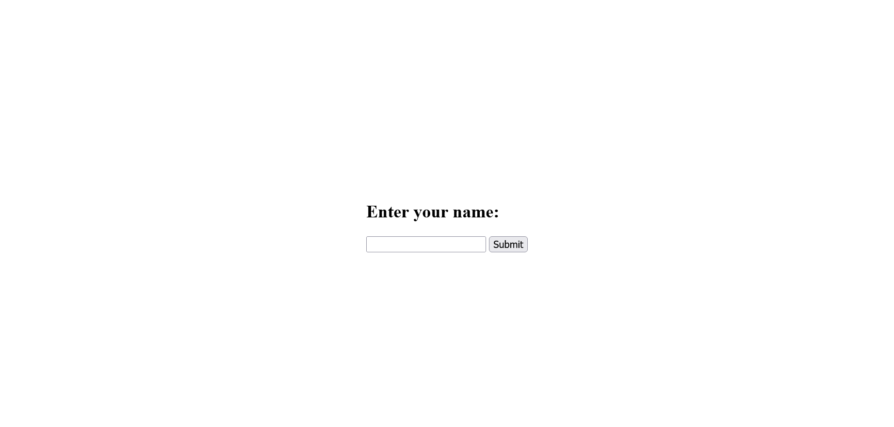

# Develop with Ubuntu on WSL

The easiest way to access your Ubuntu development environment in WSL is by using Visual Studio Code via the built-in `Remote` extension.

## What you will learn

- How to install WSL and Ubuntu on WSL from the terminal
- How to set up Visual Studio Code for remote development with Ubuntu on WSL
- How to create a basic Node.js webserver on Ubuntu using Visual Studio Code
- How to preview HTML served from an Ubuntu WSL instance in a native browser on Windows

## What you will need

- A PC with Windows 10 or 11

## Install Ubuntu on WSL2

The Windows Subsystem for Linux (WSL) must first be installed on your machine before you can use Ubuntu on WSL.
### Install WSL

Open a PowerShell prompt as an Administrator and run:

```{code-block} text
> wsl --install
```

This command will enable the features necessary to run WSL and also install the latest Ubuntu distribution available for WSL. It is recommended to reboot your machine after this initial installation to complete the setup.

### Install Ubuntu on WSL

WSL supports a variety of Ubuntu releases. Check our [reference on the distributions](https://documentation.ubuntu.com/wsl/en/latest/reference/distributions/) for more information.

There are multiple ways of installing Ubuntu on WSL, here we focus on using the terminal.
For other installation methods, refer to your dedicated guide:

- [Install Ubuntu on WSL2](https://documentation.ubuntu.com/wsl/en/latest/guides/install-ubuntu-wsl2/)

In a PowerShell terminal, run `wsl --list --online` to see all available distros and versions:

```{code-block} text
The following is a list of valid distributions that can be installed.
The default distribution is denoted by '*'.
Install using 'wsl --install -d <Distro>'.

  NAME                                   FRIENDLY NAME
* Ubuntu                                 Ubuntu
  Debian                                 Debian GNU/Linux
  kali-linux                             Kali Linux Rolling
  Ubuntu-18.04                           Ubuntu 18.04 LTS
  Ubuntu-20.04                           Ubuntu 20.04 LTS
  Ubuntu-22.04                           Ubuntu 22.04 LTS
  Ubuntu-24.04                           Ubuntu 24.04 LTS
...

```

Your list may be different once new distributions become available.

You can install a version using a NAME from the output, for example:

```{code-block} text
> wsl --install -d Ubuntu-24.04
```

You'll see an indicator of the installation progress in the terminal:

```{code-block} text
Installing: Ubuntu 24.04 LTS
[==========================72,0%==========                 ]
```

Use `wsl -l -v` to see all your currently installed distros and the version of WSL they are using:

```{code-block} text
  NAME            STATE           VERSION
  Ubuntu-20.04    Stopped         2
* Ubuntu-24.04    Stopped         2
```

### Running basic Linux commands on WSL

After installation, you should run some basic commands to confirm your installation and get familiar with the Linux environment. You can run some of the commands listed below:

1. **pwd**: This will display the full path of your current location in WSL

2. **mkdir myFirstFolder**: This will create a directory (folder on windows) called **myFirstFolder**

## Creating and viewing files in your WSL development environment

WSL allows you to create files and folders from the terminal interface, just like Linux. Let's see how to create files in WSL and interact with the files in a native Windows app such as the file explorer.

### Create an HTML file in WSL

First, you should create a new directory (call it **ubuntuWSL** for this tutorial) to save your file. Use the `mkdir` command we saw earlier:

```{code-block} text
$ mkdir ubuntuWSL
```

Next, you should navigate into the new directory:

```{code-block} text
$ cd ubuntuWSL
```

After you complete the step above, you can create an HTML file by using `nano`. `nano` is a command-line text editor and it comes pre-installed with Ububtu WSL. You can use it to quickly create and edit files right from your terminal. Type this command to create a `index.html` file from the terminal:

```{code-block} text
$ nano index.html
```

The command above will open a text editor in your WSL instance. Paste this HTML snippet into the editor:

```html
<!DOCTYPE html>
<html lang="en">
  <head>
    <title>Document</title>
  </head>
  <body>
    <h1>Hello, World!</h1>
  </body>
</html>
```

Type `ctrl + s` to save your file and the `ctrl + x` to exit the edtior.
To confirm that your file contains actual HTML, type `cat index.html`. You should see the content of your HTML file displayed on the terminal.

### Browse your WSL files in Windows explorer

Interacting with files and folders from the terminal can be daunting, especially for a Windows user. It is possible to interact with your files in WSL from Windows explorer by typing the command below:

```{code-block} text
$ explorer.exe .
```

The command will open up your current folder in Windows explorer.

### Serving static HTML in WSL with Python

Python is a programming language that comes pre-installed with Ubuntu in WSL. You can use it for multiple things, including serving HTML files to your browser. In your command like, type ths following command:

```{code-block} python
$ python3 -m http.server
```

Next, visit `http://localhost:8000/` to see your HTML document displayed on the browser:


You can exit the server by typing `ctrl +c`

## Install Visual Studio Code on Windows

One of the advantages of WSL is that it can interact with the native Windows version of Visual Studio Code using its remote development extension.

To install Visual Studio Code, visit the Microsoft Store and search for Visual Studio Code.

Then click **Install**.


Alternatively, you can install Visual Studio Code [from the web link](https://code.visualstudio.com/Download).


During installation, under the 'Additional Tasks' step, ensure you check the `Add to PATH` option.


Once the installation is complete, open Visual Studio Code.

## Install the Remote Development Extension

Navigate to the `Extensions` menu in the sidebar and search for `Remote Development`.

This is an extension pack that allows you to open any folder in a container, remote machine, or in WSL. Alternatively, you can just install `Remote - WSL` via the terminal.


Once installed we can test it out by creating an example local web server with Python.

## Create a new Python project

Python is a programming languages that comes pre-installed with WSL so you don't need to install it like you would on native Windows. We'll build a simple web server with Python to demonstrate how to work with WSL from windows.

Open your WSL Ubuntu terminal and create a new folder for our server:

```{code-block} text
$ mkdir serverexample/
```

Then navigate into it:

```{code-block} text
$ cd serverexample/
```

Now, open up your folder in Visual Studio Code, with the following command:

```{code-block} text
$ code .
```

The first time you do this, it will trigger a download for the necessary dependencies:


Once complete, your native version of Visual Studio Code will open the folder.

### Creating a virtual environment and installing dependencies

In Visual Studio Code, type `ctrl + j` to open up a terminal with a WSL instance. We'll create our virtual environment and install necessary packages here.

Inside your terminal type this command:

```{code-block} text
$ python3 -m venv env
```

Now, activate the virtual environment with this command:

```{code-block} text
source env/bin/activate
```

After you type the command, you will notice that `(env)` appears before your prompt. This means your virtual environment is active.

Now, you can install the necessary dependencies for the project. In this tutorial, we'll only use Flask. Type this command in your terminal:

```{code-block} text
$ pip install flask
```

If you face issues, try using `pip3` instead of `pip`.

Once Flask is installed, we can build our basic web server with it.

## Creating a basic web server

We'll create a basic web server that takes the user's name as input and returns a greeting message.

In Visual Studio Code, create a file called `app.py` and paste this code into it:

```{code-block} python
from flask import Flask, request, render_template

app = Flask(__name__)

@app.route("/", methods=["GET", "POST"])
def home():
    name = None
    if request.method == "POST":
        name = request.form.get("name")
    return render_template("index.html", name=name)

if __name__ == "__main__":
    app.run(debug=True)
```

The code above defines a single route that listens for a POST request and returns an HTML template.
Save the file and close it.

Now create a folder called `templates`. Inside it, create a file called `index.html`. You should paste the code below into the file:

```{code-block} html
<!DOCTYPE html>
<html>
  <head>
    <title>Greeting App</title>
    <style>
      body {
        display: flex;
        justify-content: center;
        align-items: center;
        height: 100vh;
      }
    </style>
  </head>
  <body>
    <div>
      <h2>Enter your name:</h2>
      <form method="post">
        <input type="text" name="name" required />
        <button type="submit">Submit</button>
      </form>
      
      <h3>Hello, {{ name }}!</h3>
      
    </div>
  </body>
</html>
```

The HTML above simply contains a form to take user input and displays a greeting with their name if they enter it.

Now save your files and type this command in your terminal:

```{code-block} text
$ python3 app.py
```

Next, navigate to `http://127.0.0.1:5000/` in your browser. You should see the image below. Type in your name and confirm that it returns a greeting.



That's it! You have successfully created a web server inside WSL and displayed it in a Wiindows native browser.

## Enjoy Ubuntu on WSL!

In this tutorial, we’ve shown you how to connect the Windows version of Visual Studio Code to your Ubuntu on WSL filesystem and launch a basic Node.js webserver.

We hope you enjoy using Ubuntu inside WSL. Don’t forget to check out our other tutorials for tips on how to optimise your WSL setup for Data Science.

### Further Reading

- [Install Ubuntu on WSL2](../howto/install-ubuntu-wsl2.md)
- [Microsoft WSL Documentation](https://learn.microsoft.com/en-us/windows/wsl/)
- [Setting up WSL for Data Science](https://ubuntu.com/blog/wsl-for-data-scientist)
- [Ask Ubuntu](https://askubuntu.com/)
